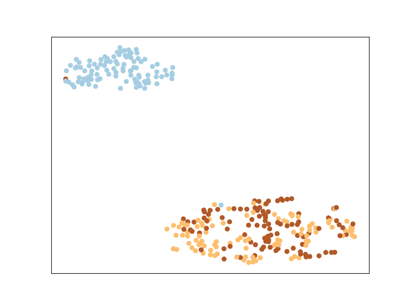
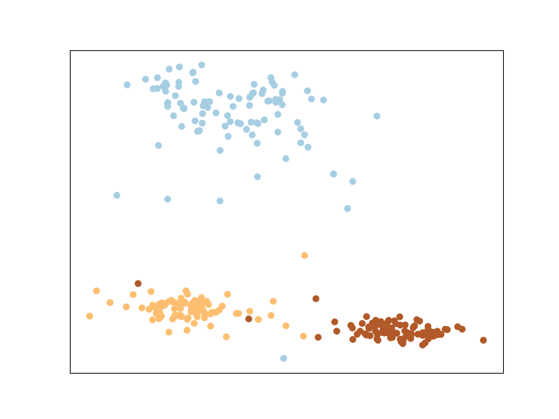

# en-HOPE: "Exemplar-centered Supervised Shallow Parametric Data Embedding"


A python implementation based on the article "Exemplar-centered Supervised Shallow Parametric Data Embedding"[1] (en-HOPE).

To select the exemplars for en-HOPE, we run a supervised k-means: a different k-means for each class to obtain the centroids (number of desirable examples per class). We apply the Stochastic Gradient Descent (SGD) to optimize the en-HOPE parameters during its training. The parameters were stated as in the article ("F", "m", "epochs", "output_dim" and "exemplars_per_class") and can have its values chosen and changed.

[1] Min, Martin Renqiang, Hongyu Guo, and Dongjin Song. "Exemplar-centered Supervised Shallow Parametric Data Embedding." In IJCAI. 2017. ([pdf](https://www.ijcai.org/proceedings/2017/0345.pdf))

## Install
Let's first clone the repository and then change to the cloned directory:

```
git clone https://github.com/barbarabenato/enhope.git && cd enhope/
```

Then we install the main requirements:
```
pip install .
```

You can test the installation by running:
```
python
>>> import enhope
>>>
```

If there are no error messages, you should be good to go.


## Running
An example of using en-HOPE is provided. You can run it by executing:
```
python run_example.py
```

A toy example data is randomly generated with sklearn. The generated data's plot is saved as "original.png". You should see something like:



Then, we train en-HOPE. You see the loss for each epoch as:
>[1] loss: 0.9707
>
>[2] loss: 0.9585
>
>[3] loss: 0.9486
>
>[4] loss: 0.9403
>
>[5] loss: 0.9332
>
>[6] loss: 0.9270
>
>[7] loss: 0.9214
>
>[8] loss: 0.9163
>
>[9] loss: 0.9117
>
>[10] loss: 0.9074
> ...


After 1000 epochs, the reduced space provided by en-HOPE is saved as "reduced.png". 



